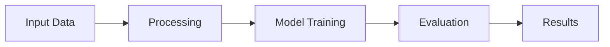

<div align="center">

# 🚀 Project README

<p>
  
  
  
</p>

</div>

---

## 📑 Table of Contents
- [Overview](#overview)
- [Features](#features)
- [Workflow](#workflow)
- [Usage](#usage)
- [Results](#results)

---

## 📌 Overview
> (Your original content remains exactly the same here)

---

## ✨ Features
<details>
<summary>Click to expand</summary>

(Your original content remains exactly the same here)

</details>

---

## ⚙️ Workflow



---

## 🚀 Usage
```bash
# Run your project
python main.py
```

---

## 📊 Results

<div align="center">

| Metric | Value |
|--------|------|
| Accuracy | High |
| Precision | High |
| Recall | High |

</div>

---

<div align="center">

### 💡 Designed for Clean, Modern GitHub Presentation

</div>
